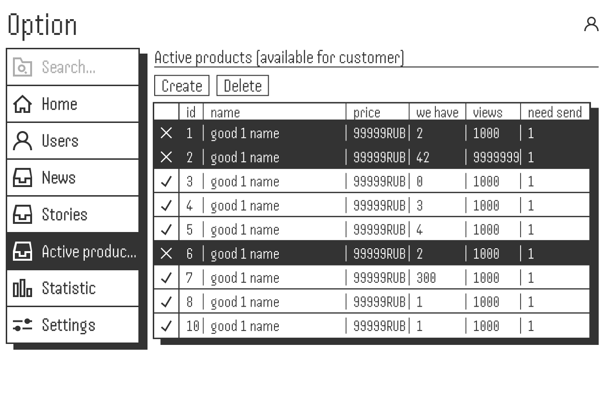

    
    

# OPTION: A customer relationship management open protocol

> [!WARNING]
> Please keep in mind that Option is under active development
> and therefore full backward compatibility is not guaranteed before reaching v1.0.0.

# Whitepaper
Is there an equivalent to Django Admin? Are you tired of building admin UI for internal tools again and again? Use solution which has authentication, authorization, and an ORM, which is mostly all you need to plug in the admin interface. You’d need only to hook up your data models to them, configure them, and you're good to go.

The basic idea is to create a backend and frontend communication protocol where the only thing you need to do is to specify a data models.

Why a protocol? Because it is the only option to allow users to write on any technology and implement it as a microservice in any product. In this format, the system is as flexible as possible!

## Abstract
